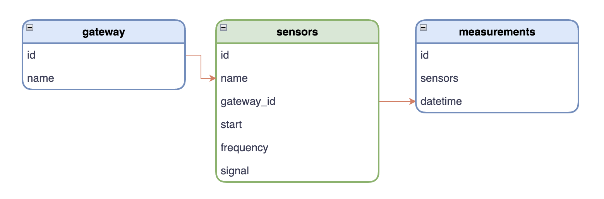

# 

# Desafio 🧑🏻‍💻

O objetivo deste desafio foi testar minhas habilidades com o python e manipulação de dados. 📌

Para o desenvolvimento deste aplicativo, foi usado Git, Python, FastApi, Pandas, Numpy, SqlAlchemy, Postgres e docker. 🛠

Dentro da pasta database, encontram-se alguns arquivos de extensão pickle que são parte de um database segmentado, e um arquivo json que contem um esquema requerido de saída de dados.

As bases de dados estão dividas em 3 partes (**sensors**, **gateway** e **measurements**):



O arquivo `database.py` gera um dataframe único que possui todas as colunas indicadas abaixo:

```
{
"gateway_id":"string",
 "gateway_name":"string",
 "number_of_registered_sensors":"int",
 "valid_configurations":"boolean",
 "percentual_valid_configurations":"float",
 "expected_measurements":"float",
 "signal_mean_value":"float",
 "signal_status":"string",
 "signal_issue":"float",
 "elapsed_time_since_last_measurement":"datetime",
 "measurement_status":"string",
 "one_hour_groups":"int"
}
```

Para essa aplicação utilizei um banco de dados relacional, o Postgres. Tentei fazer a estrutura mais simples possivel para que ficasse leve, e utilizei querys para as buscas onde pude obter todas as informações necessárias para retornar o que era solicitado.

A arquitetura da aplicação foi feita com 3 camadas que são Model, Service e Views.

Para a conexão com o banco de dados utilizei um ORM (SQALchemy) para a realização de um CRUD (create, read, update, delete) com FastApi que me permite adicionar dados obtidos, linha a linha.

---

## Primeiros passos 💻

Será necessário que a porta 8000 esteja disponível para a aplicação e o Postgres usará a porta 5432,
além disso será necessário a instalação do docker, docker-compose e pipenv.

Verifique se sua máquina possui o pipenv, 


```
pipenv --version
```

Caso não possuir instalado localmente, fazer o seguinte passo para instalação local.


- para macOs:

```
brew install pipenv
```

- para ubuntu:

```
sudo apt install pipenv
```

Inicie o banco de dados postgres usando o comando abaixo

```
docker-compose up -d
```

Modifique arquivo `.env.example` renomeando para `.env` e adicione o caminho para a pasta do projeto a váriavel PYTHONPATH. Para saber o caminho da pasta use o comando abaixo no terminal da raiz do projeto

```
pwd
```

Inicie o ambiente Virtual Python

```
pipenv shell
```

Instale as dependências

```
pipenv install
```

Crie a tabela no banco de dados

```
python api/init_db.py
```

Inicie a aplicação

```
uvicorn main:app --reload
```

---

# Documentação 📄

Após rodar a aplicação a documentação deverá estar disponível pelo endereço abaixo

```
http://127.0.0.1:8000/docs
```

---

# Autor 🧑🏻‍💻

@Ytellon
